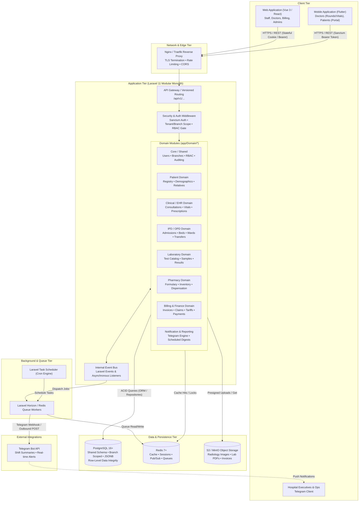
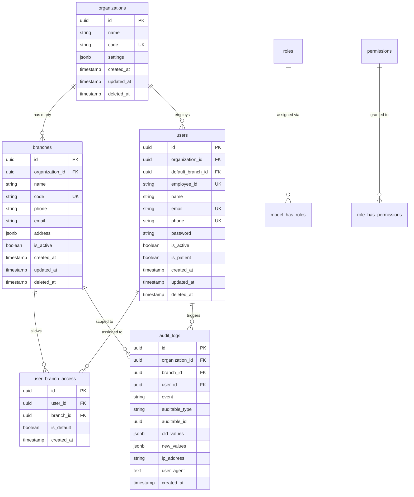
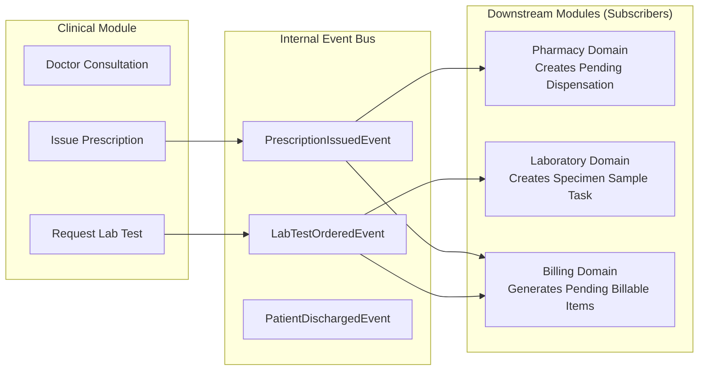
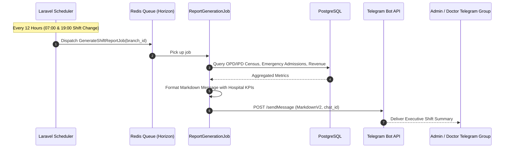

# Hospital Management System (HMS) — System Architecture Blueprint

> **System Architecture Version:** 1.0.0  
> **Target Framework:** Laravel 11.x (PHP 8.3+)  
> **Database:** PostgreSQL 16+  
> **Primary Cache & Queue Broker:** Redis 7+  
> **Client Applications:** Vue 3 / React SPA (Web), Flutter (Mobile iOS/Android)  
> **External Gateways:** Telegram Bot API (Reporting & Automated Incident Digests), S3/MinIO (Object Storage)

---

## 1. High-Level Architecture Overview

The Hospital Management System (HMS) is structured as a **Modular Monolith** organized around Domain-Driven Design (DDD) principles. This architecture delivers the operational simplicity, transactional integrity (ACID), and unified deployment of a single Laravel codebase, while strictly isolating clinical and operational domains to allow independent parallel development across different engineering teams and AI agents.

### 1.1 Architectural Topology Diagram



---

## 2. Multi-Tenancy Architecture Decision

### 2.1 Evaluated Paradigms

| Criteria | 1. Database-Per-Tenant | 2. Schema-Per-Tenant (PostgreSQL) | 3. Shared-Schema with Branch/Tenant Scoping (Recommended) |
| :--- | :--- | :--- | :--- |
| **Data Isolation** | Physical separation. Complete isolation. | Logical separation via PostgreSQL `search_path`. | Logical separation via `organization_id` & `branch_id` + Row-Level Scoping. |
| **Patient Mobility** | Impossible without distributed syncing/federated DBs. | Requires cross-schema joins (`tenant1.patients JOIN tenant2.patients`). | **Native and immediate.** Patient record is unified; visits link to branch. |
| **Staff Mobility** | Doctor credentials duplicated across instances. | Multi-schema authentication complexity. | **Seamless.** One login, assigned roles across multiple branches. |
| **Infrastructure Cost** | High. Many database servers, connection pool sprawl. | Medium-High. Schema limits, PgBouncer overhead with schema switches. | **Low & Highly Cost-Effective.** Single connection pool, consolidated cache. |
| **Migrations / DevOps** | Exponential. 50 tenants = 50 migration runs. | High. Migrations run in loops across schemas; high failure rate. | **Instant.** Standard `php artisan migrate` applies to the entire system at once. |
| **Reporting & Analytics** | Requires complex ETL data warehouse extraction. | Requires complex cross-schema aggregation queries. | **Instant.** Executive dashboards aggregate branches in single fast SQL queries. |

### 2.2 Final Architectural Recommendation: Shared-Schema Multi-Branch

#### Rationale & Healthcare Domain Drivers:
1. **Clinical Continuity of Care:** In real-world hospital networks, a patient registered at Branch A (e.g., Downtown Clinic) frequently presents at Branch B (e.g., Regional Trauma Center). A fragmented database or schema-per-tenant model creates siloed medical records, risking medical errors (e.g., drug-drug allergies recorded at one branch invisible to doctors at another).
2. **Staff Rotation:** Specialist physicians, on-call surgeons, and relief nurses rotate across branches. Shared-schema with branch-scoped RBAC allows a user to log in once and operate with assigned permissions in their active branch.
3. **Operational Overhead & Cost:** Multi-tenant medical installations must be cost-efficient to deploy. A shared schema reduces database memory footprints, utilizes PostgreSQL B-Tree indexing efficiently, and eliminates migration synchronization risks during releases.

#### Tenant vs. Branch Hierarchy:
To future-proof for SaaS or Multi-Hospital Enterprise Holdings while serving multi-branch hospitals today, a two-level hierarchy is enforced:
- **`organizations` (Top-Level Tenant):** The legal health system corporation (e.g., "Metro Health System").
- **`branches` (Operating Facilities):** Physical hospitals, satellite clinics, or diagnostic centers belonging to the organization (e.g., "Metro General - Central", "Metro Outpatient - North").
- **Scoping Rule:** All transaction tables contain `branch_id` (and inherit `organization_id`). All queries are scoped globally using Laravel Eloquent `GlobalScope` (`BranchScope`).

---

## 3. Authentication & Authorization (RBAC) Strategy

### 3.1 Authentication Strategy: Laravel Sanctum

**Laravel Sanctum** is selected over Laravel Passport:
- **Web SPA (Vue/React):** Uses Sanctum's first-party **stateful cookie authentication** (`HttpOnly`, `SameSite=Lax`, CSRF-protected). Access tokens are never stored in `localStorage` or `sessionStorage`, mitigating Cross-Site Scripting (XSS) credential theft.
- **Mobile Application (Flutter):** Uses Sanctum's **Personal Access Tokens** (`Bearer <token>`). Tokens have explicit device names, IP logging, configurable TTLs (e.g., 30 days for mobile, 12 hours for clinical tablets), and revocable abilities.
- **Why not Passport?** Passport implements a full OAuth2 Authorization Server (RFC 6749) with Public/Private RSA keys, client credentials, and authorization code flows. This adds massive unnecessary architectural complexity for an internal first-party clinical ecosystem.

### 3.2 Role-Based Access Control (RBAC) Architecture

RBAC is standardized using a unified permission schema compatible with `spatie/laravel-permission` with **Team/Branch context enabled**.

#### Defined Roles:
1. `super_admin`: Full system access, tenant setup, audit ledger inspection.
2. `hospital_admin`: Branch-level administration, user management, clinic department configs, tariff master setup.
3. `doctor`: Clinical consultations, vitals review, diagnostic ordering, prescribing, IPD admission/discharge authorization.
4. `nurse`: Vitals collection, nursing notes, Medication Administration Record (MAR) execution, bed transfer coordination.
5. `pharmacist`: Prescription validation, medication dispensing, stock management, batch/expiry controls.
6. `lab_technician`: Specimen collection logging, lab test execution, result entry, quality control verification.
7. `billing_officer`: Invoice generation, charge sheet auditing, insurance/HMO pre-authorization, payment collection.
8. `staff` / `receptionist`: Patient registration, appointment scheduling, patient check-in, queue management.
9. `patient`: Self-service portal access (restricted exclusively to their own appointments, vitals, lab reports, and billing invoices).

#### Branch-Scoped Role Assignment:
A user's role can vary by branch (e.g., Dr. Jane is a `doctor` at Branch 1, but acts as `hospital_admin` at Branch 2).
```php
// Spatie Team/Branch Scoped Assignment
setPermissionsTeamId($branchId);
$user->assignRole('doctor');
```

#### Standard Permission Naming Convention:
`<domain>.<resource>.<action>`

Examples:
- `patient.demographics.create`, `patient.demographics.view`, `patient.demographics.update`, `patient.demographics.delete`
- `clinical.consultation.create`, `clinical.prescription.authorize`, `clinical.vitals.record`
- `ipd.admission.create`, `ipd.bed.assign`, `ipd.discharge.authorize`
- `laboratory.order.create`, `laboratory.sample.collect`, `laboratory.result.verify`
- `pharmacy.stock.receive`, `pharmacy.dispense.execute`, `pharmacy.inventory.adjust`
- `billing.invoice.create`, `billing.payment.process`, `billing.discount.apply`
- `reports.telegram.manage`, `audit.logs.view`

---

## 4. Core Shared Database Schema (DDL)

These foundational tables **must exist** before any clinical or feature module is constructed. All tables use **UUIDv7 / ULID** for primary keys, soft deletes where auditability is required, and explicit indexing.



### 4.1 SQL DDL Schema Definition (PostgreSQL 16)

```sql
-- Enable necessary extensions
CREATE EXTENSION IF NOT EXISTS "uuid-ossp";
CREATE EXTENSION IF NOT EXISTS "pgcrypto";

-- 1. Organizations (Top-level multi-hospital holding)
CREATE TABLE organizations (
    id UUID PRIMARY KEY DEFAULT gen_random_uuid(),
    name VARCHAR(255) NOT NULL,
    code VARCHAR(50) NOT NULL UNIQUE,
    tax_number VARCHAR(100),
    settings JSONB DEFAULT '{}'::jsonb NOT NULL,
    is_active BOOLEAN DEFAULT true NOT NULL,
    created_at TIMESTAMP WITH TIME ZONE DEFAULT CURRENT_TIMESTAMP NOT NULL,
    updated_at TIMESTAMP WITH TIME ZONE DEFAULT CURRENT_TIMESTAMP NOT NULL,
    deleted_at TIMESTAMP WITH TIME ZONE
);

CREATE INDEX idx_organizations_code ON organizations(code);

-- 2. Branches (Physical facilities / clinics)
CREATE TABLE branches (
    id UUID PRIMARY KEY DEFAULT gen_random_uuid(),
    organization_id UUID NOT NULL REFERENCES organizations(id) ON DELETE RESTRICT,
    name VARCHAR(255) NOT NULL,
    code VARCHAR(50) NOT NULL,
    phone VARCHAR(50),
    email VARCHAR(255),
    address JSONB DEFAULT '{}'::jsonb NOT NULL,
    settings JSONB DEFAULT '{}'::jsonb NOT NULL,
    is_active BOOLEAN DEFAULT true NOT NULL,
    created_at TIMESTAMP WITH TIME ZONE DEFAULT CURRENT_TIMESTAMP NOT NULL,
    updated_at TIMESTAMP WITH TIME ZONE DEFAULT CURRENT_TIMESTAMP NOT NULL,
    deleted_at TIMESTAMP WITH TIME ZONE,
    CONSTRAINT uq_branches_org_code UNIQUE (organization_id, code)
);

CREATE INDEX idx_branches_org_id ON branches(organization_id);

-- 3. Users (Staff, Clinicians, Patients)
CREATE TABLE users (
    id UUID PRIMARY KEY DEFAULT gen_random_uuid(),
    organization_id UUID NOT NULL REFERENCES organizations(id) ON DELETE RESTRICT,
    default_branch_id UUID REFERENCES branches(id) ON DELETE SET NULL,
    employee_id VARCHAR(50),
    name VARCHAR(255) NOT NULL,
    email VARCHAR(255) NOT NULL,
    phone VARCHAR(50),
    password VARCHAR(255) NOT NULL,
    is_active BOOLEAN DEFAULT true NOT NULL,
    is_patient BOOLEAN DEFAULT false NOT NULL,
    email_verified_at TIMESTAMP WITH TIME ZONE,
    remember_token VARCHAR(100),
    created_at TIMESTAMP WITH TIME ZONE DEFAULT CURRENT_TIMESTAMP NOT NULL,
    updated_at TIMESTAMP WITH TIME ZONE DEFAULT CURRENT_TIMESTAMP NOT NULL,
    deleted_at TIMESTAMP WITH TIME ZONE,
    CONSTRAINT uq_users_org_email UNIQUE (organization_id, email),
    CONSTRAINT uq_users_org_employee UNIQUE (organization_id, employee_id)
);

CREATE INDEX idx_users_org_id ON users(organization_id);
CREATE INDEX idx_users_default_branch ON users(default_branch_id);
CREATE INDEX idx_users_is_patient ON users(is_patient);

-- 4. User Branch Access (Multi-branch affiliation)
CREATE TABLE user_branch_access (
    id UUID PRIMARY KEY DEFAULT gen_random_uuid(),
    user_id UUID NOT NULL REFERENCES users(id) ON DELETE CASCADE,
    branch_id UUID NOT NULL REFERENCES branches(id) ON DELETE CASCADE,
    is_default BOOLEAN DEFAULT false NOT NULL,
    created_at TIMESTAMP WITH TIME ZONE DEFAULT CURRENT_TIMESTAMP NOT NULL,
    CONSTRAINT uq_user_branch UNIQUE (user_id, branch_id)
);

-- 5. Audit Logs (Immutable regulatory compliance ledger)
CREATE TABLE audit_logs (
    id UUID PRIMARY KEY DEFAULT gen_random_uuid(),
    organization_id UUID NOT NULL REFERENCES organizations(id) ON DELETE RESTRICT,
    branch_id UUID REFERENCES branches(id) ON DELETE SET NULL,
    user_id UUID REFERENCES users(id) ON DELETE SET NULL,
    event VARCHAR(50) NOT NULL, -- created, updated, deleted, viewed, exported
    auditable_type VARCHAR(255) NOT NULL,
    auditable_id UUID NOT NULL,
    old_values JSONB,
    new_values JSONB,
    ip_address INET,
    user_agent TEXT,
    created_at TIMESTAMP WITH TIME ZONE DEFAULT CURRENT_TIMESTAMP NOT NULL
);

CREATE INDEX idx_audit_logs_auditable ON audit_logs(auditable_type, auditable_id);
CREATE INDEX idx_audit_logs_user ON audit_logs(user_id);
CREATE INDEX idx_audit_logs_branch ON audit_logs(branch_id);
CREATE INDEX idx_audit_logs_created_at ON audit_logs(created_at DESC);
CREATE INDEX idx_audit_logs_new_values_gin ON audit_logs USING gin (new_values);

-- 6. System Settings
CREATE TABLE system_settings (
    id UUID PRIMARY KEY DEFAULT gen_random_uuid(),
    organization_id UUID NOT NULL REFERENCES organizations(id) ON DELETE CASCADE,
    branch_id UUID REFERENCES branches(id) ON DELETE CASCADE, -- NULL = global org setting
    key VARCHAR(100) NOT NULL,
    value JSONB NOT NULL,
    description TEXT,
    is_encrypted BOOLEAN DEFAULT false NOT NULL,
    created_at TIMESTAMP WITH TIME ZONE DEFAULT CURRENT_TIMESTAMP NOT NULL,
    updated_at TIMESTAMP WITH TIME ZONE DEFAULT CURRENT_TIMESTAMP NOT NULL,
    CONSTRAINT uq_settings_key UNIQUE (organization_id, branch_id, key)
);

-- 7. Media & Attachments (Polymorphic media storage metadata)
CREATE TABLE media_attachments (
    id UUID PRIMARY KEY DEFAULT gen_random_uuid(),
    organization_id UUID NOT NULL REFERENCES organizations(id) ON DELETE CASCADE,
    branch_id UUID REFERENCES branches(id) ON DELETE SET NULL,
    attachable_type VARCHAR(255) NOT NULL,
    attachable_id UUID NOT NULL,
    disk VARCHAR(50) DEFAULT 's3' NOT NULL,
    file_path TEXT NOT NULL,
    file_name VARCHAR(255) NOT NULL,
    mime_type VARCHAR(100) NOT NULL,
    size_in_bytes BIGINT NOT NULL,
    checksum_sha256 VARCHAR(64),
    uploaded_by UUID REFERENCES users(id) ON DELETE SET NULL,
    created_at TIMESTAMP WITH TIME ZONE DEFAULT CURRENT_TIMESTAMP NOT NULL,
    updated_at TIMESTAMP WITH TIME ZONE DEFAULT CURRENT_TIMESTAMP NOT NULL,
    deleted_at TIMESTAMP WITH TIME ZONE
);

CREATE INDEX idx_media_attachable ON media_attachments(attachable_type, attachable_id);
```

---

## 5. API Design Conventions & Standards

All modules communicate externally through a strictly governed JSON REST API.

### 5.1 Route Naming & Versioning Strategy
- **Versioning:** URI path-based versioning is mandatory: `/api/v1/...`
- **Pluralized Resource Nouns:** Strict REST convention:
  - `GET /api/v1/patients` — List patients
  - `POST /api/v1/patients` — Register patient
  - `GET /api/v1/patients/{id}` — Retrieve patient details
  - `PUT /api/v1/patients/{id}` — Full update
  - `PATCH /api/v1/patients/{id}` — Partial update
  - `DELETE /api/v1/patients/{id}` — Soft delete
- **Sub-resources & Actions:**
  - Nested relations: `GET /api/v1/patients/{patient_id}/admissions`
  - Explicit domain actions (RPC-style within REST): POST with verb noun:
    - `POST /api/v1/ipd/admissions/{id}/discharge`
    - `POST /api/v1/billing/invoices/{id}/void`
    - `POST /api/v1/pharmacy/prescriptions/{id}/dispense`

### 5.2 Header Conventions
Every request and response MUST include standard metadata headers:
- `X-Branch-ID: <uuid>`: Specifies active branch context (validated against user's permitted branches).
- `X-Correlation-ID: <uuid>`: Distributed trace identifier passed through logs, queues, and Telegram error alerts.
- `Accept: application/json`

### 5.3 Response Envelope Specification

#### Success Response (Single Resource)
```json
{
  "success": true,
  "message": "Patient record retrieved successfully.",
  "data": {
    "id": "0191e4ab-02fc-7294-81d3-6e3e5bc84f50",
    "mrn": "MRN-2026-00049",
    "first_name": "Abebe",
    "last_name": "Kebede",
    "date_of_birth": "1988-04-12",
    "gender": "male",
    "blood_group": "O+",
    "branch_id": "0191e499-e65b-76b3-96b0-77a83d7fca12",
    "created_at": "2026-09-12T01:15:00Z",
    "updated_at": "2026-09-12T01:15:00Z"
  },
  "meta": {
    "correlation_id": "9b1deb4d-3b7d-4bad-9bdd-2b0d7b3dcb6d",
    "timestamp": "2026-09-12T01:15:52Z",
    "version": "v1"
  }
}
```

#### Success Response (Paginated Collection)
Pagination standard defaults to offset/page for filtered data tables, and cursor-based for high-throughput append logs (e.g., audit trail).
```json
{
  "success": true,
  "message": "Patients retrieved successfully.",
  "data": [
    {
      "id": "0191e4ab-02fc-7294-81d3-6e3e5bc84f50",
      "mrn": "MRN-2026-00049",
      "name": "Abebe Kebede",
      "phone": "+251911223344"
    }
  ],
  "meta": {
    "pagination": {
      "total": 1420,
      "count": 1,
      "per_page": 15,
      "current_page": 1,
      "total_pages": 95,
      "has_more": true
    },
    "correlation_id": "9b1deb4d-3b7d-4bad-9bdd-2b0d7b3dcb6d",
    "timestamp": "2026-09-12T01:15:52Z"
  },
  "links": {
    "first": "/api/v1/patients?page=1&per_page=15",
    "last": "/api/v1/patients?page=95&per_page=15",
    "prev": null,
    "next": "/api/v1/patients?page=2&per_page=15"
  }
}
```

#### Standard Error Response Envelope
```json
{
  "success": false,
  "message": "The given data was invalid.",
  "error_code": "VALIDATION_FAILED",
  "errors": {
    "email": [
      "The email has already been taken in this organization."
    ],
    "phone": [
      "The phone format is invalid."
    ]
  },
  "meta": {
    "correlation_id": "9b1deb4d-3b7d-4bad-9bdd-2b0d7b3dcb6d",
    "timestamp": "2026-09-12T01:15:52Z"
  }
}
```

### 5.4 Standard HTTP Status Codes
- `200 OK`: Successful GET, PUT, PATCH, or non-creation POST actions.
- `201 Created`: Resource successfully created via POST.
- `204 No Content`: Successful DELETE with empty body.
- `400 Bad Request`: Generic client syntax error or business constraint violation.
- `401 Unauthorized`: Missing or invalid Bearer token / unauthenticated session.
- `403 Forbidden`: Authenticated user lacks RBAC permission or branch access.
- `404 Not Found`: Resource ID does not exist within the scoped branch/organization.
- `422 Unprocessable Entity`: Form request validation error.
- `429 Too Many Requests`: Rate limit reached.
- `500 Internal Server Error`: Uncaught server exception (logged with correlation ID).

### 5.5 Querying Standard (Spatie QueryBuilder Conventions)
To allow modular frontend developers to filter and sort predictably:
- **Filtering:** `?filter[status]=active&filter[search]=Abebe`
- **Sorting:** `?sort=-created_at,last_name` (`-` prefix denotes descending)
- **Whitelisted Inclusions:** `?include=admissions,insurance_policies`

---

## 6. Database Conventions & Architectural Rules

### 6.1 Primary Key Strategy: UUIDv7 / ULID
**Decision:** All primary keys MUST use time-ordered 128-bit identifiers (**UUIDv7** or **ULID** stored as PostgreSQL native `UUID` type).

#### Why Not Auto-Increment (BigInteger)?
1. **Security & Data Exposure:** Sequential integer IDs (`/patients/1024`) allow competitors or malicious actors to enumerate patient volume and forge predictable URLs.
2. **Distributed ID Generation:** Mobile clients (e.g., offline triage apps) and asynchronous micro-actions can generate valid IDs before hitting the database without ID collisions.
3. **Multi-Branch Merging:** If two branches ever need to merge databases or sync offline records, integer auto-increments guarantee collision catastrophic failures; UUIDv7 guarantees global uniqueness.

#### Why UUIDv7 / ULID Over UUIDv4 (Random)?
- **B-Tree Index Clustering:** Standard UUIDv4 values are completely random, causing extreme B-tree page splits and index thrashing on tables with millions of rows.
- **Timestamp Prefix:** UUIDv7 embeds a millisecond-precision Unix timestamp in the most significant 48 bits. Rows are physically clustered on disk in approximate insertion order, matching PostgreSQL index cache locality.

In Laravel models:
```php
use Illuminate\Database\Eloquent\Concerns\HasUuids;
// or HasUlids
```

### 6.2 Naming Conventions
- **Tables:** `snake_case`, pluralized (`patients`, `patient_vitals`, `billing_invoices`).
- **Pivot Tables:** alphabetical singular of both tables joined with underscore (`patient_allergy`, `branch_user`).
- **Columns:** `snake_case` (`medical_record_number`, `date_of_birth`).
- **Foreign Keys:** `{singular_table}_id` (`patient_id`, `branch_id`).
- **Polymorphic Columns:** `{name}_type` and `{name}_id` (`billable_type`, `billable_id`).
- **Booleans:** Prefixed with `is_`, `has_`, or `can_` (`is_active`, `is_discharged`, `has_insurance`).
- **Timestamps:** `created_at`, `updated_at`, and `deleted_at` for soft deletes.

### 6.3 Soft Deletes & Auditability Policy
1. **Clinical and Financial Immutability:** In compliance with healthcare standards and financial auditing, hard `DELETE` queries are strictly prohibited on:
   - `patients`
   - `clinical_consultations`, `prescriptions`, `patient_vitals`
   - `ipd_admissions`
   - `lab_test_orders`, `lab_test_results`
   - `billing_invoices`, `billing_payments`
2. **Cancellation / Reversal Pattern:** Invoices, admissions, and orders are cancelled via state machine transitions (e.g., `status = 'cancelled'`, `status = 'voided'`), requiring a mandatory `cancellation_reason` and generating an `audit_logs` record.
3. **Soft Deletes:** Tables supporting soft deletes use Laravel's `SoftDeletes` trait.
4. **Audit Triggering:** Any mutating operation (INSERT, UPDATE, DELETE, SOFT-DELETE) triggers an entry in the centralized `audit_logs` table via model observers.

---

## 7. Infrastructure & Environment Configuration

### 7.1 Complete `.env.example` Specification

```ini
# ==============================================================================
# HOSPITAL MANAGEMENT SYSTEM (HMS) ENVIRONMENT CONFIGURATION
# ==============================================================================

APP_NAME="Hospital Management System"
APP_ENV=local
APP_KEY=
APP_DEBUG=true
APP_TIMEZONE="UTC"
APP_URL=http://localhost:8000
FRONTEND_URL=http://localhost:3000

APP_LOCALE=en
APP_FALLBACK_LOCALE=en

LOG_CHANNEL=stack
LOG_STACK=daily
LOG_LEVEL=debug

# Database Configuration (PostgreSQL 16+)
DB_CONNECTION=pgsql
DB_HOST=127.0.0.1
DB_PORT=5432
DB_DATABASE=hms_master
DB_USERNAME=postgres
DB_PASSWORD=postgres
DB_SCHEMA=public

# Redis Configuration (Cache, Sessions, Queues)
REDIS_CLIENT=phpredis
REDIS_HOST=127.0.0.1
REDIS_PASSWORD=null
REDIS_PORT=6379
REDIS_DB_CACHE=0
REDIS_DB_QUEUE=1
REDIS_DB_SESSION=2

# Cache & Session
CACHE_STORE=redis
SESSION_DRIVER=redis
SESSION_LIFETIME=120
SESSION_ENCRYPT=false

# Queue Driver
QUEUE_CONNECTION=redis
HORIZON_PREFIX=hms_horizon:

# Storage Driver (Local for dev, S3/MinIO for staging/prod)
FILESYSTEM_DISK=s3
AWS_ACCESS_KEY_ID=minioadmin
AWS_SECRET_ACCESS_KEY=minioadmin
AWS_DEFAULT_REGION=us-east-1
AWS_BUCKET=hms-clinical-docs
AWS_ENDPOINT=http://127.0.0.1:9000
AWS_USE_PATH_STYLE_ENDPOINT=true

# Telegram Bot Reporting & Incident Engine
TELEGRAM_BOT_TOKEN="123456789:ABCdefGHIjklMNOpqrsTUVwxyz"
TELEGRAM_REPORTING_CHAT_ID="-100987654321"     # Operations channel for daily shift reports
TELEGRAM_CRITICAL_ALERT_CHAT_ID="-10011223344"  # Critical incident & hardware/system alert channel
TELEGRAM_BOT_ENABLED=true

# Sanctum Authentication
SANCTUM_STATEFUL_DOMAINS="localhost:3000,127.0.0.1:3000,hms-web.local"
SESSION_DOMAIN=".hms-web.local"

# Mail Configuration
MAIL_MAILER=smtp
MAIL_HOST=127.0.0.1
MAIL_PORT=1025
MAIL_USERNAME=null
MAIL_PASSWORD=null
MAIL_ENCRYPTION=null
MAIL_FROM_ADDRESS="noreply@hms.hospital.internal"
MAIL_FROM_NAME="${APP_NAME}"
```

### 7.2 Queue & Scheduled Jobs Architecture

To prevent API latency during clinical workflows, heavy operations are dispatched to Redis queues handled by **Laravel Horizon**:
- **High-Priority Queue (`high`):** Real-time prescription validation, Telegram emergency alerts, critical lab panic-value notifications.
- **Default Queue (`default`):** Standard email/SMS appointment confirmations, audit log persistence.
- **Low-Priority Queue (`low`):** Telegram daily shift executive reports, nightly bed census calculations, automated invoice generation.

#### Cron Tasks (`routes/console.php` or Scheduler):
1. **Daily Operational Shift Digest (Telegram):** Dispatched at 07:00 and 19:00 (bed occupancy, daily revenue, emergency admissions).
2. **Pharmacy Low-Stock & Expiry Scanner:** Runs every 6 hours; sends warnings to Telegram and dispensary managers.
3. **Unpaid Invoice / HMO Claim Stale Follow-up:** Daily at 02:00.

---

## 8. Domain-Driven Folder & Module Structure

The project employs a **Modular Monolith** structure under `app/Domain/`. Each domain is self-contained with its own models, actions, controllers, requests, resources, events, listeners, and tests.

### 8.1 Directory Blueprint

```
app/
├── Domain/
│   ├── Shared/                              <-- Shared kernel & base architectural classes
│   │   ├── Contracts/                       <-- Cross-domain interfaces (e.g. BillableInterface)
│   │   ├── Enums/                           <-- System-wide enums (Gender, BloodGroup, Priority)
│   │   ├── Exceptions/                      <-- Base domain exceptions
│   │   ├── Http/
│   │   │   ├── Middleware/                  <-- BranchScopeMiddleware, EnforceJsonMiddleware
│   │   │   └── Responses/                   <-- ApiResponse helper envelope
│   │   ├── Models/
│   │   │   ├── BaseModel.php                <-- Base Eloquent model with UUIDv7 & Auditing
│   │   │   ├── Organization.php
│   │   │   ├── Branch.php
│   │   │   ├── User.php
│   │   │   ├── AuditLog.php
│   │   │   └── MediaAttachment.php
│   │   ├── Scopes/                          <-- BranchScope (enforces WHERE branch_id = ...)
│   │   ├── Services/                        <-- Centralized FileStorageService, TelegramService
│   │   └── Traits/                          <-- BelongsToBranch, HasUuidV7, Auditable
│   │
│   ├── Patient/                             <-- Feature Module: Patient Management
│   │   ├── Actions/                         <-- RegisterPatientAction, UpdateDemographicsAction
│   │   ├── DTOs/                            <-- PatientRegistrationData
│   │   ├── Enums/                           <-- MaritalStatus, IdentificationType
│   │   ├── Events/                          <-- PatientRegisteredEvent, PatientUpdatedEvent
│   │   ├── Http/
│   │   │   ├── Controllers/                 <-- PatientController, EmergencyContactController
│   │   │   ├── Requests/                    <-- RegisterPatientRequest, UpdatePatientRequest
│   │   │   └── Resources/                   <-- PatientResource, PatientCollection
│   │   ├── Models/                          <-- Patient, EmergencyContact, PatientAllergy
│   │   ├── Policies/                        <-- PatientPolicy
│   │   ├── Providers/                       <-- PatientDomainServiceProvider
│   │   ├── Routes/
│   │   │   └── api.php                      <-- /api/v1/patients routes
│   │   └── Tests/                           <-- Feature & Unit tests for Patient domain
│   │
│   ├── Clinical/                            <-- Clinical Consultations, Vitals & Prescriptions
│   ├── IPD/                                 <-- Inpatient Department (Admissions, Beds, Wards)
│   ├── OPD/                                 <-- Outpatient Department (Triage, Clinics)
│   ├── Laboratory/                          <-- Lab Orders, Specimen Tracking, Results
│   ├── Pharmacy/                            <-- Drug Inventory, Prescriptions, Dispensing
│   ├── Billing/                             <-- Tariffs, Invoices, Payments, Insurance Claims
│   └── Reporting/                           <-- Telegram Bot Engine, Executive Dashboards
```

### 8.2 Domain Service Provider Standard
Each domain provides a dedicated `DomainServiceProvider` registered in `bootstrap/providers.php`. This allows each module to register its own routes, migrations, and event listeners independently:

```php
namespace App\Domain\Patient\Providers;

use Illuminate\Support\ServiceProvider;
use Illuminate\Support\Facades\Route;

class PatientDomainServiceProvider extends ServiceProvider
{
    public function register(): void
    {
        // Bind repositories and domain interfaces
    }

    public function boot(): void
    {
        $this->loadMigrationsFrom(__DIR__ . '/../Database/Migrations');
        
        Route::prefix('api/v1/patients')
            ->middleware(['api', 'auth:sanctum'])
            ->group(__DIR__ . '/../Routes/api.php');
    }
}
```

---

## 9. Inter-Module Contracts & Decoupling Patterns

When multiple developers or AI agents build different modules simultaneously, **strict inter-module boundaries** prevent code tangling and schema lock-in.



### 9.1 Foreign Key Reference Rules
1. **Shared Master Foreign Keys (Permitted Directly):**
   Every module may directly set foreign key constraints to the shared kernel tables:
   - `branch_id` -> references `branches(id)`
   - `patient_id` -> references `patients(id)`
   - `created_by` / `user_id` / `doctor_id` -> references `users(id)`
2. **Sibling Module Decoupling (No Hard Direct SQL FKs Across Sibling Modules):**
   - Sibling modules (e.g., `Billing` referencing `IPD Admission` or `Laboratory Test`) must NOT tightly couple models with raw class dependencies where possible.
   - Use **Polymorphic Reference** or **Event-driven Invoice Generation**.

### 9.2 The `BillableInterface` Contract
The `Billing` module must remain completely agnostic of whether a charge originated from a pharmacy drug, a lab test, a bed stay, or an operating theatre fee:

```php
namespace App\Domain\Billing\Contracts;

interface BillableInterface
{
    public function getBillableId(): string;
    public function getBillableType(): string;
    public function getPatientId(): string;
    public function getBranchId(): string;
    public function getDescription(): string;
    public function getUnitPriceInCents(): int;
    public function getQuantity(): int;
    public function getTaxAmountInCents(): int;
}
```

Any entity (e.g., `PrescriptionItem`, `LabTestOrder`, `BedStayHour`) implementing this contract can be passed directly to `BillingService::createInvoiceItem(BillableInterface $item)`.

### 9.3 Event-Driven Integration (Loose Coupling)
Modules communicate changes of state using Domain Events. The producer module dispatches the event and terminates its HTTP request; listening modules perform asynchronous reaction.

| Producer Domain | Event Dispatched | Consumer Domain | Reaction / Action |
| :--- | :--- | :--- | :--- |
| **Clinical** | `PrescriptionCreatedEvent` | **Pharmacy** | Creates a pending dispensation order in the pharmacy queue. |
| **Clinical** | `PrescriptionCreatedEvent` | **Billing** | Attaches pending drug charges to patient unbilled folio. |
| **Clinical** | `LabOrderCreatedEvent` | **Laboratory** | Generates barcode task for phlebotomy sample collection. |
| **IPD** | `PatientDischargedEvent` | **Billing** | Finalizes bed occupancy charges; locks invoice for settlement. |
| **IPD** | `PatientDischargedEvent` | **Notification** | Sends discharge summary alert & Telegram hospital census update. |
| **Laboratory** | `PanicResultDetectedEvent` | **Notification** | Sends high-priority Telegram alert to on-duty attending physician. |

---

## 10. Telegram Bot Reporting & Notification Architecture

The Telegram Bot API is utilized for administrative summaries, shift handover reports, and high-priority clinical alarms without requiring staff to open laptops or monitor email inboxes.



### 10.1 Telegram Notification Classes
Located in `app/Domain/Reporting/Services/TelegramNotificationService.php`:
- `sendShiftSummary(Branch $branch, ShiftSummaryDto $dto)`
- `sendCriticalAlert(string $title, string $details, string $severity)`
- `sendLowStockWarning(Collection $criticalMedications)`

---

## 11. Acceptance & Implementation Checklist for Developers/Agents

When creating an individual module (e.g., `Patient`, `IPD`, `Billing`, `Pharmacy`, `Laboratory`):

1. **Namespace & Path:** Place all code in `app/Domain/{ModuleName}/`.
2. **Migrations:** Place in `app/Domain/{ModuleName}/Database/Migrations/`.
3. **Primary Keys:** Every table must have `id UUID PRIMARY KEY DEFAULT gen_random_uuid()`.
4. **Multi-Tenancy:** Every table must include `branch_id UUID REFERENCES branches(id) ON DELETE RESTRICT`. Apply the `BelongsToBranch` trait to all Eloquent models.
5. **Auditing:** Add the `Auditable` trait to ensure all updates and deletes are recorded in `audit_logs`.
6. **API Routes:** Register routes under `api/v1/{module-name}`. Use the standard response envelopes defined in `App\Domain\Shared\Http\Responses\ApiResponse`.
7. **Permissions:** Use the `domain.resource.action` naming standard and seed roles accordingly.
8. **Decoupling:** If this module triggers work in another module, dispatch a domain event under `app/Domain/{ModuleName}/Events/` rather than directly importing and modifying models of other domains.
